# Reports

`engmech report` writes one self-contained HTML file: the results, an
interactive free-body diagram for every load case, and everything needed
to check and trace them. It opens offline, prints as a calculation
document, and can be filed with the calculation it records.

```bash
engmech report frame.yaml --open           # writes frame.html and opens it
engmech report frame.yaml -o calc.html     # choose the file name
engmech report frame.yaml --set "P=15 kN" --units SI-mm
engmech solve frame.yaml --report calc.html  # terminal tables and a report
```

In Python, `results.report("frame.html")` does the same. A report embeds
the plotting library, about 5 MB; `--cdn` loads it from the web instead,
which keeps the file to tens of kilobytes but needs a connection to show
the diagrams.

A report leads with the results: first whether they can be trusted, then
the numbers, then the diagram, and only after that the detail that
supports them. Every screenshot on this page is a report of one of the
bundled examples (`engmech examples copy <name>`), so you can open the
same reports yourself.

- [Header and summary](#header-and-summary)
- [Load cases compared](#load-cases-compared)
- [Results](#results)
- [Free-body diagrams](#free-body-diagrams)
- [Equilibrium verification and applied loads](#equilibrium-verification-and-applied-loads)
- [Checks](#checks)
- [Notes](#notes)
- [Model](#model)
- [Provenance](#provenance)
- [Printing and PDF](#printing-and-pdf)
- [Company logo](#company-logo)

## Header and summary

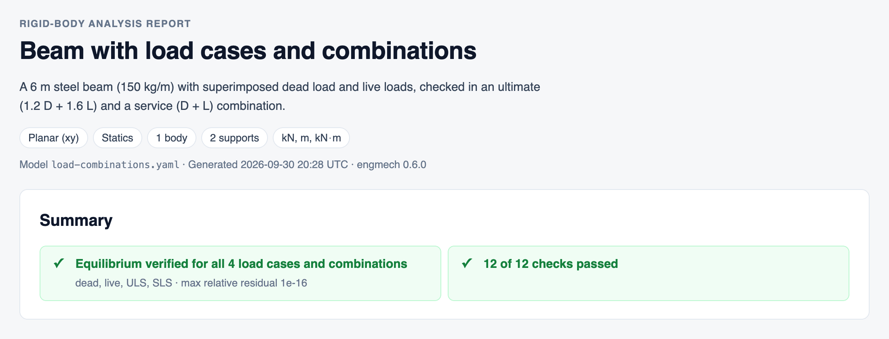

The header gives the model's name, the first paragraph of its description
(the rest, such as hand calculations, goes to [Notes](#notes)), what kind
of analysis it is, and the file, time and engmech version that produced
it.

The summary says whether the results can be used, one line per verdict:

- **Equilibrium**: whether each load case and combination is balanced and
  determinate, verified independently of the solver (see
  [Equilibrium verification](#equilibrium-verification-and-applied-loads)).
  Cases that all pass are summarised on one line.
- **Checks**: how many of the file's checks pass. A failed check turns the
  line red.
- **Warnings that apply to the whole model**: free motions the supports do
  not prevent, or results that are sensitive to small changes in the
  geometry.

### When something needs attention


A model with a problem still gets a report, and the report says what the
problem is instead of guessing. This gate hangs on two hinges, and
equilibrium alone cannot say how its weight is shared between them. The
summary turns amber, and the results say which components are
indeterminate, give the self-stress state that can be added to them in
any amount, and suggest the fix: give the hinges a stiffness, and the
weight is shared by least work. The components equilibrium cannot find
read `indet.` in the tables, and the arrows that show only part of a
reaction are marked `*`.

Loads the supports cannot hold (a mechanism) turn the summary red and name
the free motion the loads drive, for example "rotates about the point
(0, 0)". A cable in compression or a contact in tension is flagged too:
the real support would go slack or lift off.

## Load cases compared

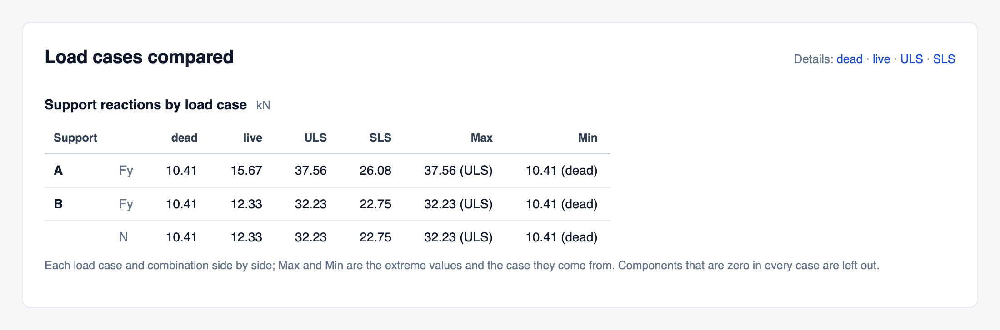

With more than one load case or combination, every support reaction and
joint force is tabulated for all of them side by side, with the largest
and smallest value and the case it comes from. Components that are zero in
every case are left out. The links at the top jump to each case's own
results.

## Results

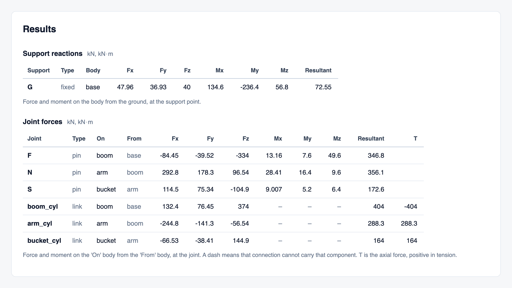

Each load case and combination has its own results, in the model's output
units (`--units` changes them):

- **Support reactions** are the force and moment *on the body from the
  ground*, at the support point, in global axes.
- **Joint forces** are on the "On" body from the "From" body; the other
  body receives the opposite.
- **Solved loads**, when the file has any, are the answers to "what force
  holds this?", positive along their given direction.

A dash means the connection cannot carry that component. `T` is the axial
force in a link or cable, positive in tension; `N` is a normal force,
positive when pushing on the body; `drive` is the torque or force an
actuated joint must supply.

## Free-body diagrams

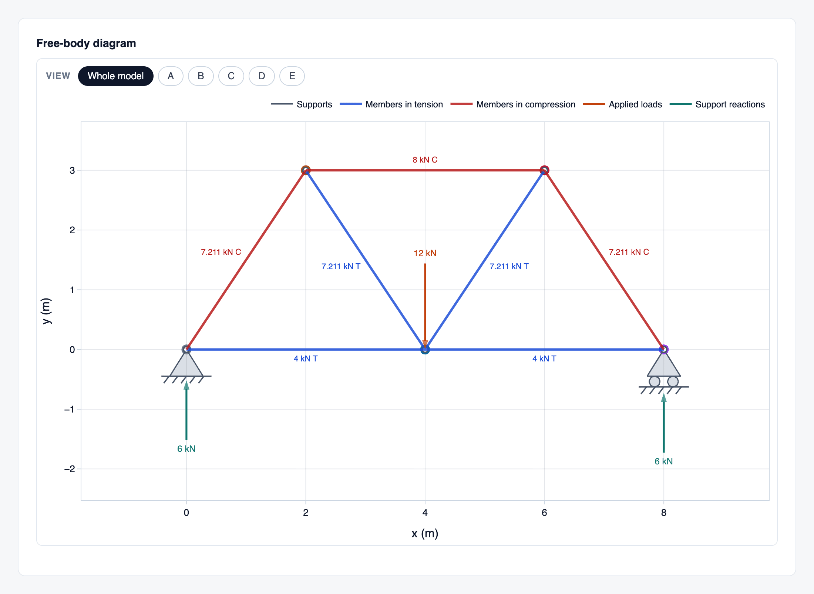

Each set of results is followed by an interactive diagram: hover over an
arrow or a member for its name and components, drag a box to zoom in, and
double-click to zoom back out. Planar models are drawn with engineering
support symbols. Links and cables are
coloured by their force, blue in tension and red in compression, so a
truss reads at a glance. Applied loads, weights, inertia (d'Alembert)
loads, reactions and joint forces each have their own colour, and every
arrow is labelled with its magnitude.

### The free body of each part

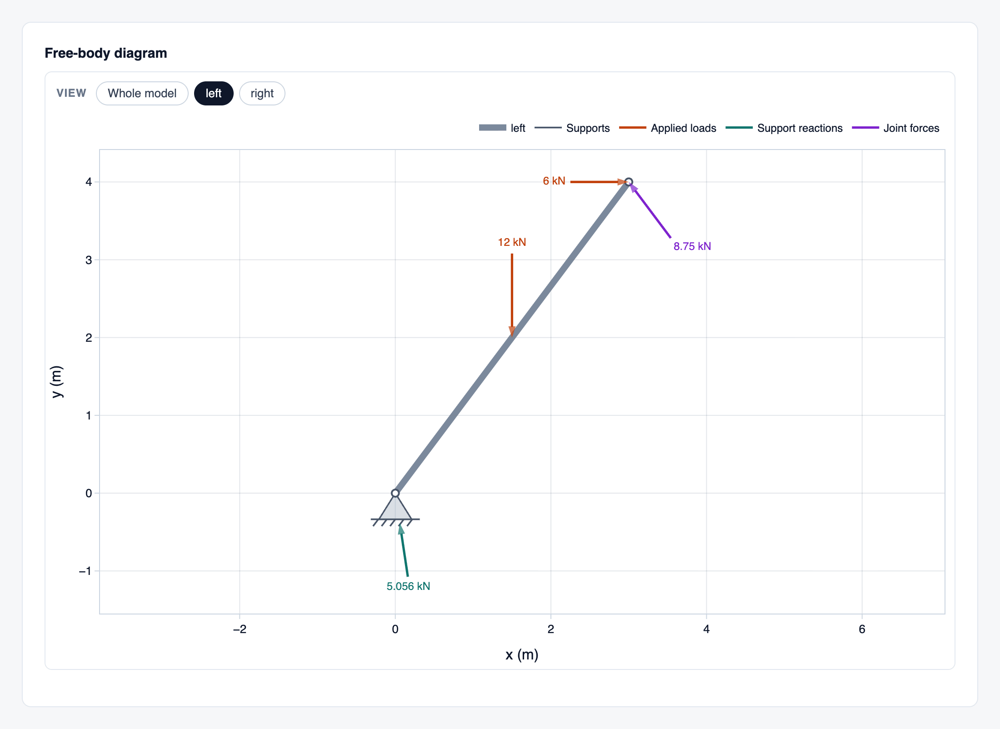

With more than one body, the buttons above the diagram switch between the
whole model and the free body of each part: the part alone, with every
load on it and the forces from its supports and from the parts it is
joined to. These are the free-body diagrams you would draw by hand to
check the result.

### 3D

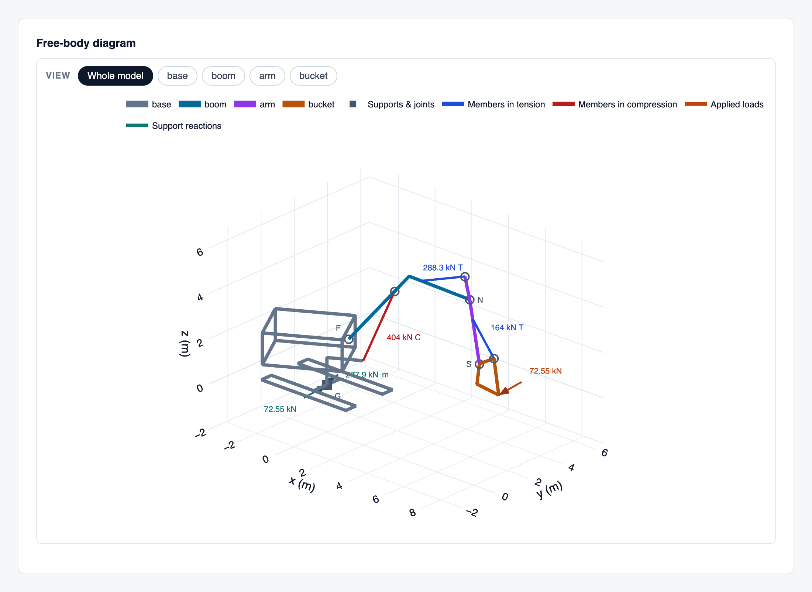

Spatial models are drawn in 3D, in an orthographic view as in an
engineering drawing: drag to turn the model, scroll to zoom. The view has
z up. Models built with y or x up, as from CAD, are drawn upright with
`report: {up: y}` in the file or `--up y` on the command line (see
[Up axis](input-format.md#up-axis)). An outline (`outline:` on a body)
draws the body as you would sketch it; the excavator's tracks and house
are one.

## Equilibrium verification and applied loads

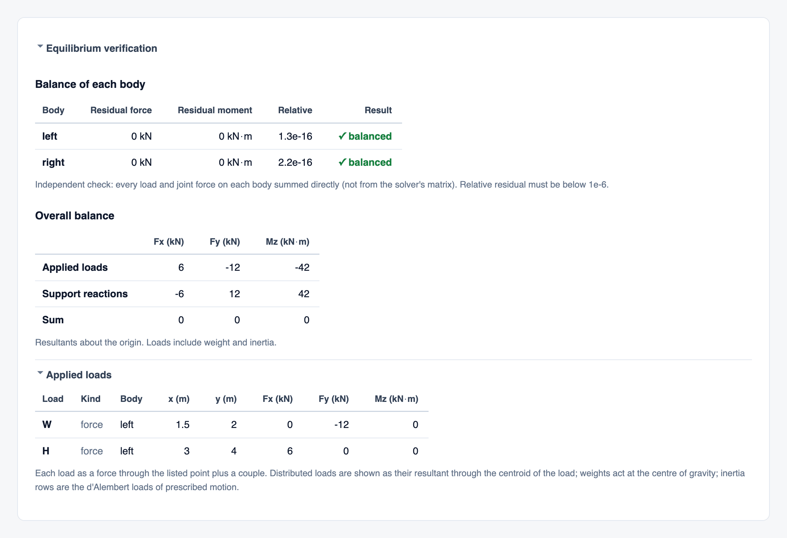

Two sections under each diagram are collapsed on screen and printed in
full:

- **Equilibrium verification** sums every load and joint force on each
  body directly, independently of the solver, and shows what is left over.
  Every body must balance to a relative residual below 10⁻⁶; the overall
  balance compares the resultant of the applied loads (weights and inertia
  included) with that of the reactions. A result that fails this check
  opens the section and turns the summary red.
- **Applied loads** lists every load in the case as a force through a point
  plus a couple: distributed loads as their resultant, weights at the
  centre of gravity, and the inertia loads of prescribed motion.

## Checks

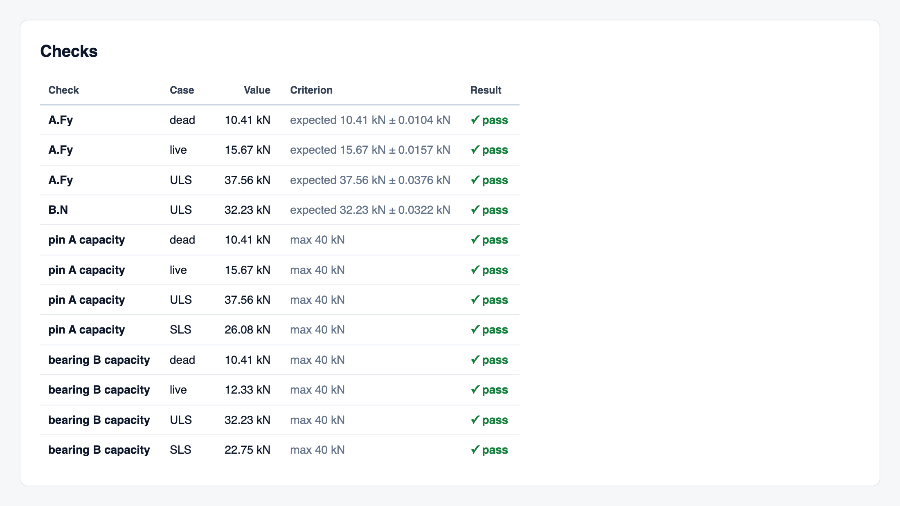

The file's `checks:` are listed with the value found, the criterion and the
result. An expected value (a hand calculation, a textbook answer) passes
within its tolerance; a `max` or `min` (a design limit) is checked in
every case and combination unless the check names one. See
[checks](input-format.md#checks) for how to write them.

## Notes

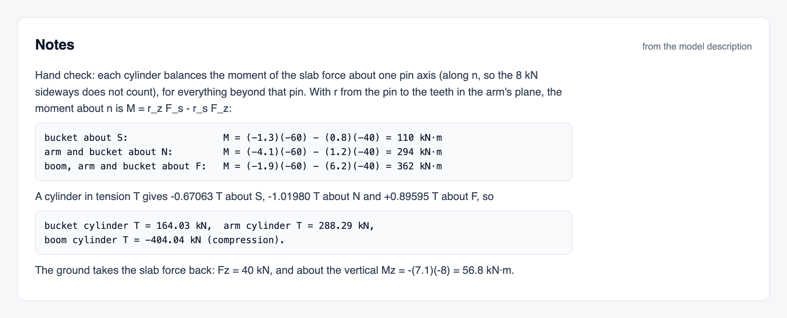

Everything in the model's description after its first paragraph is shown
here: typically the hand calculation that the checks hold, and the
assumptions. Indented lines keep their layout, so working set out in
columns stays readable.

## Model

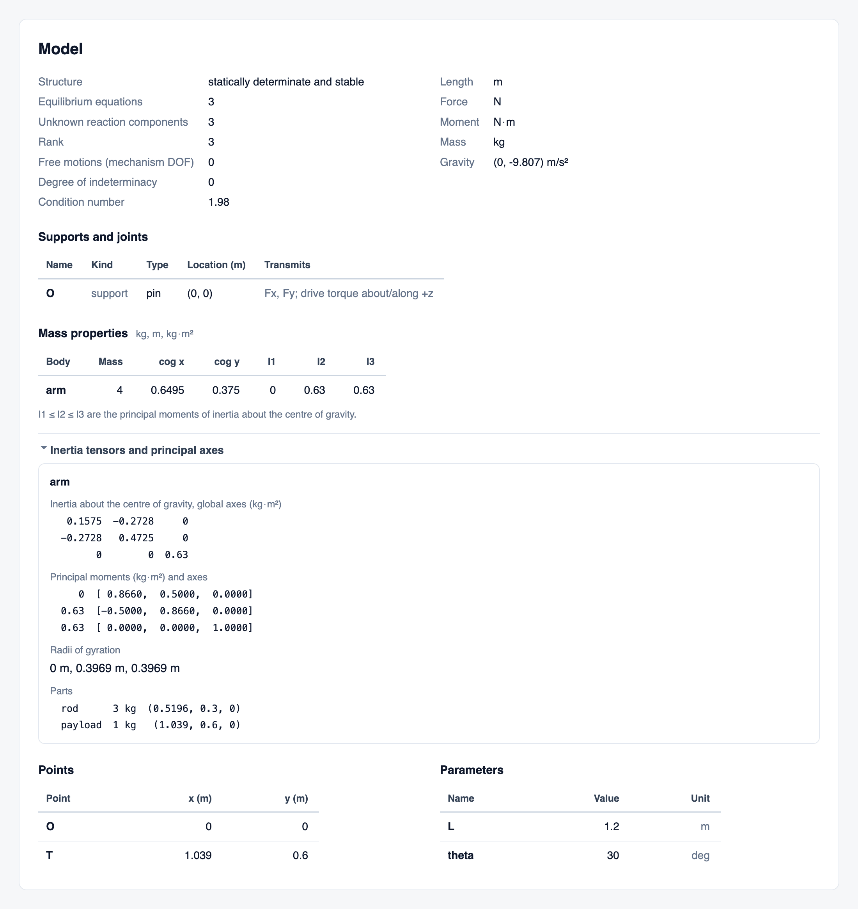

The model as engmech understood it:

- **Determinacy**: whether the structure is determinate and stable, the
  number of equations and unknowns, free motions, the degree of
  indeterminacy and the condition number of the equations.
- **Units** of the results, and **gravity**.
- **Supports and joints**, where each one is and what it transmits.
- **Mass properties** of every body with mass: mass, centre of gravity and
  principal moments of inertia. Opened, the inertia tensor about the
  centre of gravity, the principal axes, the radii of gyration, and the
  mass and centre of gravity of each part.
- **Points** and **parameters**, with their values after any `--set`.

## Provenance

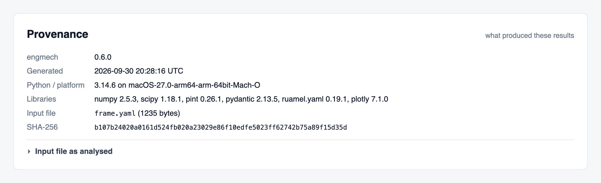

What produced the results: the engmech, Python and library versions, the
platform, the time, any parameter overrides (`--set`), and the input file
with its size and SHA-256 hash. Opened, the input file is shown exactly as
it was analysed. Together they let anyone reproduce a result, or confirm
that a filed report matches a model file.

## Printing and PDF

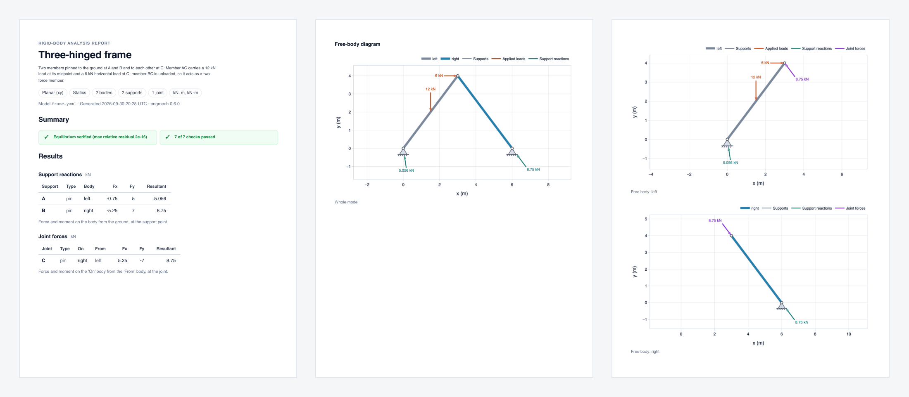

Printed, or saved as PDF from the browser's print dialog, a report becomes
a calculation document. Every diagram is drawn to the page width, the
whole model and every free body each get their own figure and caption,
and the collapsed sections (equilibrium verification, applied loads,
inertia details, the input file) are printed in full.

## Company logo

Reports have no logo unless you give one. Set it once for every report in
the user config file (`engmech config` shows where it is):

```toml
[report]
logo = "/path/to/logo.png"   # or an https:// URL; on Windows, 'C:\path\logo.png'
```

A model file's `report: {logo: ...}`, the `ENGMECH_LOGO` environment
variable, and `--logo FILE|URL` or `--no-logo` on the command line override
it, in that order from least to most specific. The logo appears at the top
right of the report and of the validation report, and it is embedded, so
the report stays self-contained. See [report](input-format.md#report) for
the formats and sizes allowed.
